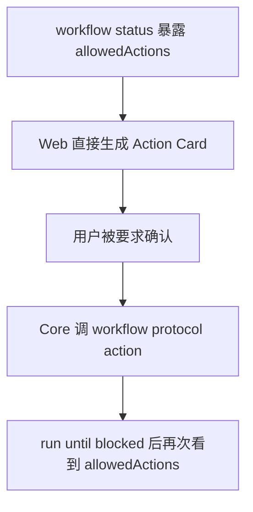
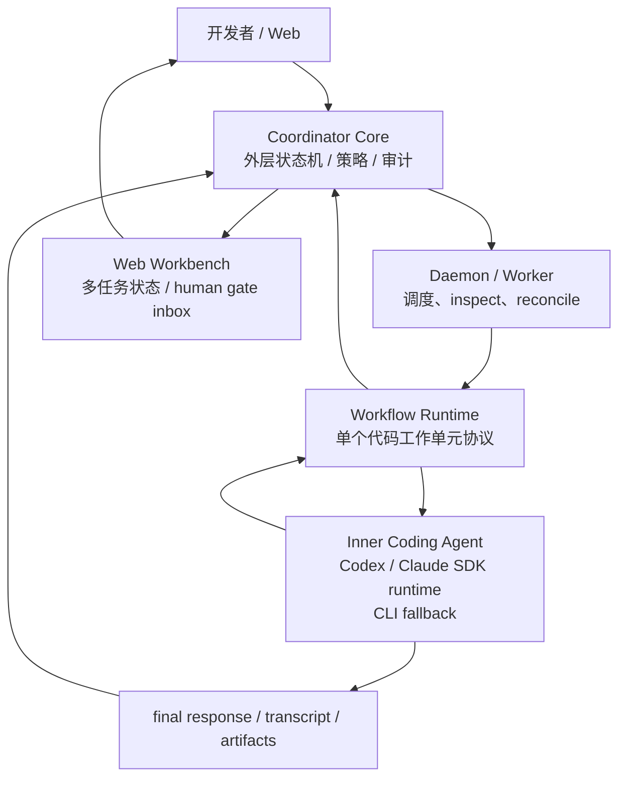
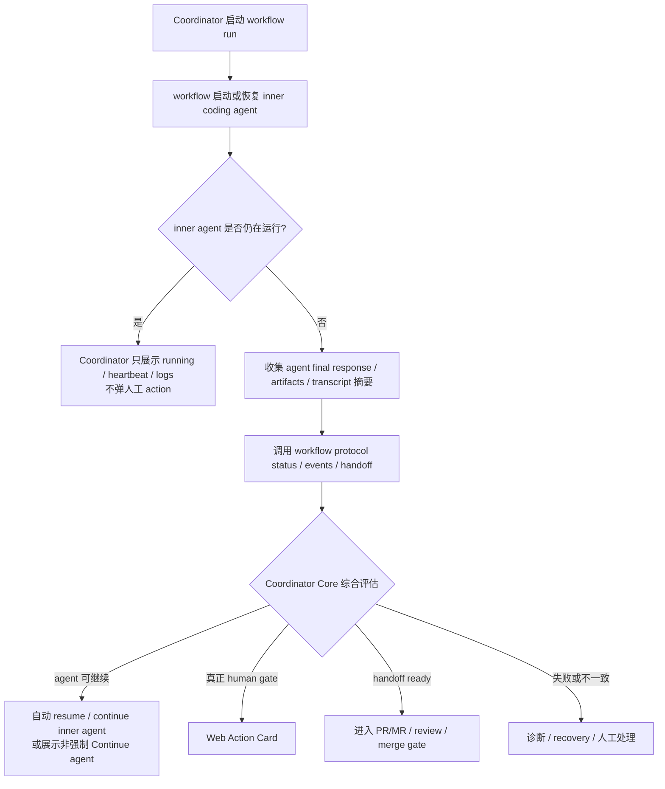

# Workflow Agent Lifecycle 交接备忘

> 状态：side conversation 设计交接备忘，供主会话继续 OpenSpec / 实现使用  
> 生成时间：2026-05-25 Asia/Shanghai  
> 适用范围：Coordinator 管理 workflow run、inner coding agent 生命周期、Web action card 展示、run until blocked 语义  
> 目标：把本次讨论形成的背景、判断、方案和后续任务整理成独立文档，避免主会话继续沿着“allowedActions 直接变成人工按钮”的方向过度实现。

> 本期约束：不修改 `/Users/hetao/Documents/github/workflow` 工程，也不要求 `workflow protocol` 立即新增字段。本文中的 `operatorActions`、`agentActions`、`blocker.owner`、`agent.state` 只作为后续可选协议增强方向；当前 Coordinator 侧先用保守分类和既有 protocol 字段避免误把内部 action 变成人工 gate。

> 当前落地：Slice 14.4 在 Coordinator 侧增加了 operator-only `workflow runtime observation` 派生摘要，用现有 protocol projection、handoff、action classification 与 agent activity 表达 `observing-runtime`、`waiting-operator-gate`、`handoff-ready`、`recovery-attention` 等模式。该摘要只服务 Web/operator 展示、Run Until Blocked explanation 和 daemon observation，不修改 workflow protocol，也不是新的外层状态机。

## 1. 背景

当前 `coordinator` 已经完成一轮 Web workflow action 闭环：

```text
Web 创建 task
-> Coordinator daemon / outer Agent 创建 execution plan、attempt、workspace
-> 启动 workflow run
-> Web 展示 workflow allowed action
-> 用户确认 action card
-> Core 受控调用 workflow protocol action
-> task-scoped run until blocked
```

真实 Web smoke 中，任务已经推进到：

```text
task: beedf929-7948-4621-a921-3ee6dbffc65b
workflow run: 129f6646-9a51-4ed5-8be6-f12d5992f6cd
external run: run-1779675757693
profile: feature
stage: implementation
substate: materialize-change
allowed action: materialize-change
required arg: change-id
handoff: unavailable
```

这说明 Web -> Core -> workflow protocol action 的受控调用链路已经可用。但同时也暴露出一个产品和架构层面的偏差：

```text
Coordinator 过早把 workflow allowedActions 等同成 operator action card。
```

在直接使用 `workflow` 时，`materialize-change <change-id>` 这类动作通常由 workflow 上下文中的 inner coding agent 创建或选择 change 后继续执行，开发者通常只在“需求冻结”“技术方案确认”“PR/MR/merge”等真正 human gate 处介入。

如果 Coordinator 把所有 `allowedActions` 都展示成需要开发者手动确认的 Web card，就会把 workflow 内部执行细节摊给开发者，反而增加复杂度。

## 2. 讨论结论

本次讨论形成的核心判断：

```text
Coordinator 不应该变成 workflow 的遥控器。
Coordinator 应该是多个 workflow run 的管理者、观察者、恢复者和人工 gate 收件箱。
```

更具体地说：

- Coordinator 应该降低开发者同时管理多个 workflow 的成本。
- Coordinator 不应该把 workflow 内部每个 `allowedAction` 都升级为人工确认。
- Coordinator 应该等待 inner coding agent 结束、阻塞、失败或 handoff 后，再结合 agent 输出和 workflow protocol 状态综合评估。
- 周期性 inspect / reconcile 可以存在，但不能在 coding agent 仍在运行时抢先打断开发者。
- Coding agent 输出是 evidence，不是状态机真源。
- Workflow protocol status / handoff 是 workflow run 的结构化真源。
- Coordinator Core 是外层任务状态机和策略校验真源。

## 3. 现有实现的偏差

当前 Web action loop 的价值是建立了受控 action 通道：

```text
Web operator intent
-> Coordinator Core 校验当前 workflow status
-> Core 复用受控 workflow protocol action helper
-> 记录 event / operation
-> refresh task
```

这个通道仍然是必要的，但它不应该成为 workflow 推进主循环。

当前偏差可以概括为：



问题在于，`allowedActions` 混合了不同语义：

| 类型 | 例子 | 理想处理者 |
| --- | --- | --- |
| inner agent action | `materialize-change <change-id>`、对齐检查、实现推进 | workflow runtime / inner coding agent |
| human approval gate | `freeze-requirements`、`approve-planning-dossier` | 开发者通过 Web 明确确认 |
| coordinator operation | create attempt / workspace / start workflow | Coordinator Core / daemon / outer Agent |
| handoff gate | PR ready / review / merge | Coordinator Core + 开发者 |
| recovery action | inspect / retry / resume | daemon / Core，必要时人工 |

因此，`allowedActions` 只能说明 workflow 内部控制面当前允许什么，不能直接等同于“开发者现在需要点什么”。

## 4. 目标模型

目标模型应该围绕 inner coding agent 生命周期，而不是围绕 allowed action 轮询。



推荐主循环：



这意味着 `run until blocked` 的语义应该调整为：

```text
跑 inner agent / workflow run 到真正停点，而不是反复看到 allowedActions 就让 Web 点按钮。
```

## 5. 分层职责

### 5.1 Coordinator Core

Core 仍然是唯一外层状态机和策略校验入口。

Core 可以：

- 创建 attempt / workspace。
- 启动 workflow run。
- 查询 workflow status / events / artifacts / handoff。
- 记录 operation ledger 和 event timeline。
- 基于结构化 protocol envelope 决定外层任务状态。
- 在 operator 明确确认后调用 workflow protocol action。

Core 不应该：

- 读取或写入 `.workflow` private state。
- 根据文件存在与否猜测 current change。
- 解析自然语言输出后直接越过 workflow gate。
- 把所有 `allowedActions` 自动暴露给开发者或 outer Agent。
- 让 daemon / outer Agent 静默执行 workflow 内部 human gate。

### 5.2 Daemon / Worker

Daemon 负责调度、恢复、观察和审计。

Daemon 可以：

- 启动或恢复可恢复的 worker / agent session。
- 周期性 inspect / reconcile。
- 在结构化状态一致时 no-op。
- 对明确可恢复的失败做 retry / resume。

Daemon 不应该：

- 在 inner coding agent 仍在运行时，因为看到 `allowedActions` 就打断开发者。
- 自动确认 human approval gate。
- 把 `actionInputs` 当作自动执行队列。

### 5.3 Inner Coding Agent

Inner coding agent 是单个 workflow run 内部的执行者。

它应该：

- 在 workflow surface / protocol 约束下工作。
- 创建或选择 OpenSpec change。
- 知道 `materialize-change <change-id>` 这类内部推进参数。
- 写代码、跑测试、产出 artifacts。
- 在 workflow 需要 human gate 时停止并形成结构化状态。

### 5.4 Web Workbench

Web 的核心产品定位仍然是多工程、多任务工作台。

Web 应该默认展示：

- 哪些任务 running。
- 哪些任务真正 needs me。
- 哪些任务进入 PR/MR/review/merge。
- 哪些任务失败或需要恢复。
- 当前 workflow stage/substate/progress 作为 explainability。

Web 不应该默认把 workflow 内部所有 action 都变成 developer 的待办。

## 6. 推荐 protocol 增强方向（未来）

当前 `workflow protocol status` 已经有：

- `lifecycle`
- `handoff`
- `summary`
- `stage`
- `substate`
- `allowedActions`
- `deniedActions`
- `actionInputs`
- `currentChange`

但 Coordinator 仍需要猜测 action 的 owner。未来可以在 workflow protocol 中增加更明确的 ownership / blocker 语义，例如：

```json
{
  "lifecycle": "active",
  "agent": {
    "state": "running",
    "provider": "codex",
    "sessionId": "..."
  },
  "blocker": {
    "owner": "agent",
    "kind": "none",
    "reason": null
  },
  "operatorActions": [],
  "agentActions": [
    {
      "id": "materialize-change",
      "requiredArgs": ["change-id"]
    }
  ],
  "handoff": {
    "available": false
  }
}
```

关键不是字段名，而是把 action ownership 显式化：

| 字段 | 语义 | Coordinator 处理 |
| --- | --- | --- |
| `operatorActions` | 真正需要开发者确认的 action | Web Action Card |
| `agentActions` | inner agent 可继续处理的 workflow action | 不进入 human inbox，可由 workflow / inner agent 推进 |
| `blocker.owner=operator` | 人工 gate | needs me |
| `blocker.owner=agent` | agent 还能继续或需要恢复 | resume / continue agent |
| `handoff.available=true` | workflow 已交接 | PR/MR/review/merge flow |

在 protocol 增强前，Coordinator 可以先做保守分层，不把所有 allowed action 都当成人工 gate。

当前版本不得把这些未来字段作为实现前置条件。Coordinator 的本期责任是保持现有 protocol 不变，并在 Web/Core 侧避免误报 human gate。

## 7. Coordinator 侧短期改进建议

### 7.1 降级 Workflow Action Panel 的触发条件

不要再用：

```text
allowedActions.length > 0 => Web Action Card
```

建议改为：

```text
operator-facing action => Web Action Card
agent/internal action => Workflow Lens debug/detail 展示，不进入 needs me
```

短期可以用 conservative allowlist：

```text
operator-facing:
- freeze-requirements
- approve-planning-dossier
- approve-review
- approve-merge / merge gate 类动作

not operator-facing by default:
- materialize-change
- run-alignment-checks
- inspect / resume 类动作
- 需要 change-id 等由 inner agent 应该知道的 action
```

这只是过渡方案；长期可以由 workflow protocol 明确返回 `operatorActions` / `agentActions` 或 `blocker.owner`，但不作为本期 Coordinator 实现前提。

### 7.2 调整 run until blocked 的停止原因

当前 run until blocked 容易停在：

```text
workflow active + allowedActions present
```

未来 protocol ownership 更明确后，理想表达可以改成：

```text
workflow active + inner agent running => 展示 running，不 needs me
workflow active + inner agent exited + blocker.owner=agent => 尝试 resume / recovery
workflow active + blocker.owner=operator => needs me
workflow handoff available => 进入 handoff flow
workflow failed / inconsistent => recovery / diagnostic
```

如果 protocol 暂时没有 `agent.state`，Coordinator 至少应避免把 `materialize-change` 这类内部 action 当作人工阻塞。

### 7.3 综合评估而不是单信号决策

Coordinator 在每轮 agent 结束后应综合：

- inner coding agent final response。
- transcript / artifacts 摘要。
- workflow protocol status。
- workflow protocol events。
- operation ledger。
- workspace / git 状态的受控检查结果。

其中：

```text
agent 输出是 evidence。
workflow protocol 是 run-level 结构化状态来源。
Coordinator Core 是外层任务状态机真源。
```

不要把自然语言 stdout / final response 单独当作可执行决策依据。

## 8. 后续实现切片建议

Slice 14.4 的 Coordinator 侧最小实现已经不再把 `allowedActions.length > 0` 直接视为人工待办。它采用的规则是：

```text
workflow active + no handoff + only agent/internal or debug actions
=> observing-runtime，owner=workflow-runtime，不进入 needs-me

workflow active + no handoff + operator-facing gate
=> waiting-operator-gate，owner=operator，只能由 Web/API/CLI operator-only intent 确认

workflow handoff available
=> handoff-ready，由 Coordinator Core 后续 PR/MR/review/merge flow 消费

workflow/provider inconsistent or failed
=> recovery-attention，由 Core recovery decision 判定是否需要 operator
```

后续如需继续演进，重点不应是扩大 Web action card，而是把 workflow runtime 与 inner coding agent 的 owner 信号协议化。

## 8.1 后续 workflow protocol 增强建议

建议未来在 `/Users/hetao/Documents/github/workflow` 中独立讨论 protocol 增强，示例：

```json
{
  "agent": {
    "state": "running",
    "lastEventSummary": "coding agent is materializing change"
  },
  "blocker": {
    "owner": "inner-agent",
    "reason": "materialize-change requires workflow-local change id"
  },
  "operatorActions": ["freeze-requirements"],
  "agentActions": ["materialize-change"]
}
```

这些字段的语义建议：

- `agent.state`：只表达 inner coding agent / workflow runtime 是否 running、completed、failed、stalled，不替代 handoff。
- `blocker.owner`：明确当前停点归属 operator、inner-agent、workflow-runtime、external-system 或 recovery。
- `operatorActions`：只包含真正需要人类确认的 gate。
- `agentActions`：包含 workflow runtime / inner coding agent 内部推进动作。
- `lastAgentEventSummary`：只提供短摘要，不输出 raw JSONL、完整 transcript 或 provider private state。

这些增强必须保持兼容：Coordinator 当前版本不能依赖它们，也不能因为字段缺失而退回“所有 allowedActions 都是 needs-me”。

## 8.2 后续 Coordinator 侧可选工作

后续 Coordinator 侧可继续做：

1. 梳理当前 `run until blocked`、daemon tick、workflow status projection、Web Action Panel 的触发路径。
2. 定义 Coordinator 侧 action classification：
   - operator-facing。
   - agent/internal。
   - debug-only。
   - unknown conservative。
3. Web 只把 operator-facing action 放入 Action Panel / needs me。
4. `materialize-change <change-id>` 暂不进入 needs me；在 Workflow Lens 中作为 debug/detail 展示。
5. 调整 banner / task card 文案，区分：
   - workflow running。
   - waiting for inner agent。
   - waiting for operator.
   - handoff ready。
6. 如果现有 runtime 无法判断 inner agent lifecycle，先实现保守策略，避免误打断开发者。
7. 增加测试覆盖：
   - `freeze-requirements` 仍显示 operator action。
   - `approve-planning-dossier` 仍显示 operator action。
   - `materialize-change` 不进入 needs me，不要求 Web operator 填 `change-id`。
   - daemon 不自动执行 `materialize-change`，只 inspect/reconcile 或等待 inner agent / workflow runtime。
8. 如果 workflow 后续提供 owner/action 分层字段，再单独新增 change 适配；适配时仍不得让 daemon 或 outer Agent 自动确认 human gate。

## 9. 验收标准

推荐验收标准：

- 从 Web 创建真实 task 后，Coordinator 可以启动 workflow run。
- 在 `requirements` 人工 gate 时，Web 显示清晰 action card，用户确认后继续。
- 在 `technical-plan` 人工 gate 时，Web 显示清晰 action card，用户确认后继续。
- 到 `materialize-change <change-id>` 时，Web 不把它当成需要开发者手动输入的 blocking card。
- Workbench 可以展示 workflow 正在由 agent / workflow runtime 继续处理，或者展示“等待 inner agent / 需要恢复”的准确状态。
- daemon / outer Agent 不自动确认 human gate。
- Coordinator 不读写 `.workflow` private state。
- PR/MR/review/merge 仍走既有 human approval gate。
- `allowedActions` / `actionInputs` 继续只作为 display/debug/operator hint，不扩大 Coordinator Agent Surface。

## 10. 风险与注意事项

### 10.1 不要把问题修成高信任自动推进

这次讨论不是要让 daemon 自动执行所有 workflow action。

正确方向是：

```text
区分 agent/internal action 和 operator action。
```

不是：

```text
allowedActions 全部自动执行。
```

### 10.2 不要让 Coordinator 读取 workflow private state

即使需要判断 `change-id`，Coordinator 也不应扫描 `.workflow` 私有文件来猜。应由 workflow protocol 或 inner agent artifact 提供稳定信息。

### 10.3 不要把自然语言输出当作协议

Inner coding agent 的 final response 可以作为 evidence，但不能替代 workflow protocol status / handoff。

### 10.4 不要把 Web 做成 workflow debug UI

Web 的主目标是多任务开发者工作台。Workflow Lens 可以解释当前阶段，但默认交互应围绕开发者真正需要决策的事项。

## 11. 给主会话的建议下一步

建议主会话继续时先不要直接推进当前 smoke task 的 `materialize-change <change-id>`。

更合理的下一步是：

```text
1. 用本备忘创建 OpenSpec change：align-workflow-agent-lifecycle。
2. 修改 Coordinator 侧 action classification 和 Web Action Panel 触发条件。
3. 让 materialize-change 不再作为人工 gate 出现在 needs me。
4. 再跑真实 Web smoke，观察 task 是否以更符合预期的方式停在真正 human gate / handoff。
5. 如需 workflow protocol 增强，再整理交接给 /Users/hetao/Documents/github/workflow。
```

一句话总结：

```text
Coordinator 应管理多个 workflow 的生命周期和人工 gate，而不是把 workflow 内部 action 序列逐个外包给开发者点击。
```
